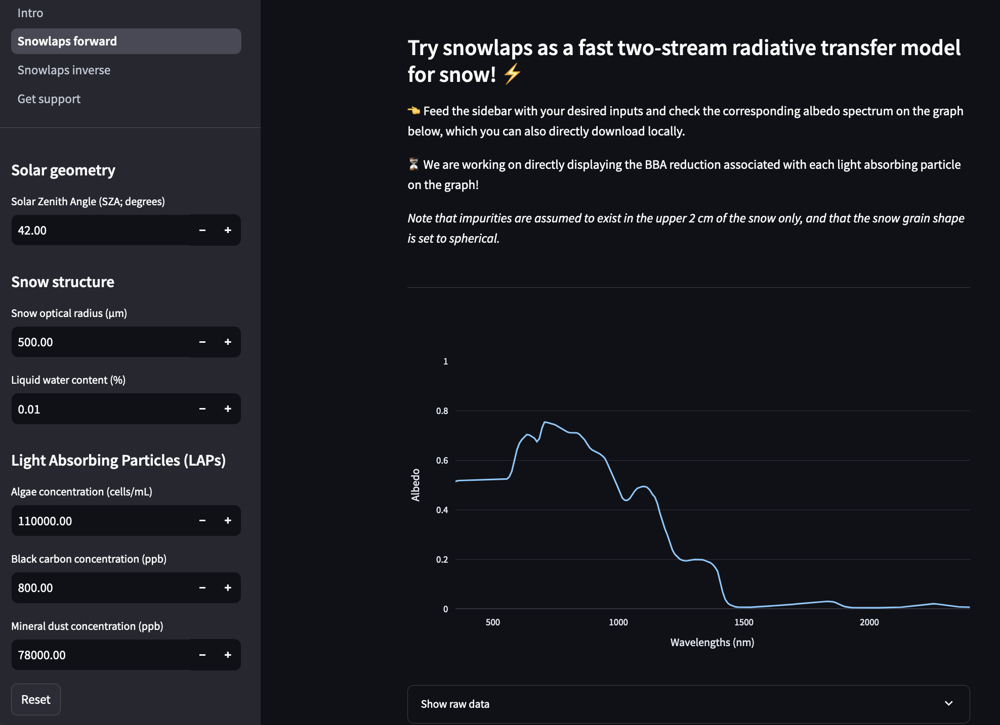

[](https://www.gnu.org/licenses/gpl-3.0)
[](https://github.com/openosmia/snowlaps/actions)
[](https://pre-commit.com/)
[](https://github.com/astral-sh/ruff)
[](https://github.com/psf/black)

# snowlaps ❄️🦠🏔️

`snowlaps` is a Python package built on a deep learning emulator of
the two-stream radiative transfer model
[biosnicar v2.1](https://github.com/jmcook1186/biosnicar-py). It was originally
developed to study the impact of different Light Absorbing Particles
(LAPs) on snow spectral albedo as part of a [research
project](https://doi.org/10.5194/egusphere-2024-2583,) in Southern
Norway. Now, `snowlaps` has grown into a library with two main use
cases.

- **forward mode**: predict snow spectral albedo from prescribed surface
  properties as a fast alternative to
  [biosnicar](https://biosnicar.vercel.app/).
- **inverse mode**: infer surface properties from snow spectral albedo
  observations.

# Installation

`snowlaps` can be installed via the command line with
[conda](https://docs.conda.io/en/latest/) and
[pip](https://pip.pypa.io/en/stable/):

```bash

# clone repository in the folder of your choice
git clone git@github.com:openosmia/snowlaps.git

# move into snowlaps directory
cd snowlaps

# create conda environment
conda env create -f environment.yml

# activate conda environment
conda activate snowlaps

# install snowlaps
pip install -e .
```

Installation can be sped up using the fast cross-platform package
manager [mamba](https://mamba.readthedocs.io/en/latest/)
(reimplementation of the conda package manager in C++), simply use
`mamba` instead of `conda` in the instructions above.

# Usage

`snowlaps` can be used directly as a Python package or interactively
via a Streamlit app.

## Running the code

Example scripts are provided in
[`snowlaps/examples`](https://github.com/openosmia/snowlaps/tree/main/examples).

- **example 1**: forward run of the snowlaps emulator
- **example 2**: inversion of hyperspectral albedo measurements
- **example 3**: comparison of snowlaps and biosnicar predictions

## Using the app

The Streamlit app can be run locally via the terminal:

```bash

# move into snowlaps directory
cd snowlaps

# start Streamlit app on http://localhost:8501
./start_app.sh
```

[]()

# Contributions

Any contribution to `snowlaps` is welcome! Feel free to add new issues, open pull requests or ask questions in the discussion forum.

# Citation

If you use this code, please cite the associated publication:

Chevrollier, L.-A., Wehrlé, A., Cook, J. M., Pirk, N., Benning, L. G., Anesio, A. M., and Tranter, M.: Separating the albedo reducing effect of different light absorbing particles on snow using deep learning, EGUsphere [preprint], https://doi.org/10.5194/egusphere-2024-2583, 2024.
